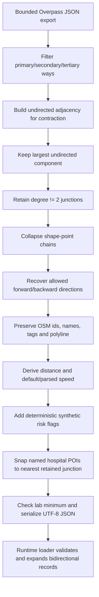

# Dataset — Đà Nẵng Central Emergency Mobility Graph

## 1. Identity card

| Field | Value in bundled snapshot |
|---|---|
| File | `backend/data/da_nang_osm_snapshot.json` |
| Dataset ID | `danang-central-emergency-osm-2026` |
| Name | Đà Nẵng Central Emergency Mobility Graph |
| Version | `1.0.0` |
| City / country | Đà Nẵng / Việt Nam |
| OSM base timestamp | `2026-08-05T01:34:50Z` |
| Generated at | `2026-08-05T01:39:13.662612+00:00` |
| Bounding box | south `16.035`, west `108.190`, north `16.090`, east `108.250` |
| Road filter | `primary|secondary|tertiary` |
| Source | OpenStreetMap contributors via a bounded Overpass snapshot |
| License | ODbL 1.0 |
| Required attribution | © OpenStreetMap contributors |

This is a **hybrid teaching dataset**. Real-world OSM topology/tags and deterministic synthetic traffic/risk are deliberately separated below.

## 2. Provenance: what is real, derived, or synthetic?

| Data/field | Category | How it is obtained | Must not be claimed as |
|---|---|---|---|
| OSM node/way IDs | OSM snapshot | returned by bounded Overpass query | a live OSM query at app runtime |
| Road topology and way node order | OSM snapshot | OSM `way` membership/order | official government road graph |
| `highway`, `name/ref`, `maxspeed`, `oneway`, `junction`, `bridge`, `tunnel`, `lanes`, `surface` | OSM tags | copied/interpreted during build | guaranteed complete/correct field survey |
| Hospital POI name/position | OSM tags/geometry | named `amenity=hospital` node/way | proof of emergency capability or current operation |
| Junction/gateway nodes | Derived from OSM | shape-point contraction of largest undirected road component | original POI for every generated display node |
| `distance_m` | Derived from OSM geometry | sum of Haversine lengths along retained polyline | surveyed driving distance |
| Default `speed_kph` when no parseable tag | Project assumption | road-class default | observed traffic speed |
| Hospital access connector | Synthetic/derived | straight line to nearest retained junction, max snap 1.5 km | verified entrance/driveway |
| Base risk by road class | Synthetic | project constants | OSM risk tag or accident statistics |
| `flood_prone`, `incident_prone`, `close_during_incident` | Synthetic deterministic | SHA-256 threshold from stable edge seed | forecast, incident feed or flood authority data |
| Scenario multiplier, congestion label, ETA and delay | Synthetic deterministic | formula in `backend/app/traffic.py` | live traffic |
| Leaflet raster basemap | Remote rendered tiles | optional browser requests to `tile.openstreetmap.org` | part of the bundled graph JSON |

The exact disclaimer stored with the dataset is:

> Road topology/tags come from OSM. Congestion, incidents, closures, flood susceptibility, risk and ETA are deterministic educational simulations—not live traffic or emergency advice.

## 3. Source query

The repository stores the reproducible query at `scripts/overpass_danang.ql`:

```overpass
[out:json][timeout:90];
(
  way["highway"~"^(primary|secondary|tertiary)$"](16.035,108.190,16.090,108.250);
  node["amenity"="hospital"](16.035,108.190,16.090,108.250);
  way["amenity"="hospital"](16.035,108.190,16.090,108.250);
  relation["amenity"="hospital"](16.035,108.190,16.090,108.250);
);
(._;>;);
out body;
```

The query asks for major-road ways and hospital features plus referenced child elements. The current builder directly creates hospital POIs from named node/way elements; it does not turn relation elements themselves into hospital nodes. Overpass is a read-only query service; it is used as a one-time export source, not a routing or traffic API.

Official references:

- [Overpass API](https://wiki.openstreetmap.org/wiki/Overpass_API)
- [Overpass QL reference](https://wiki.openstreetmap.org/wiki/Overpass_API/Overpass_QL)
- [OpenStreetMap copyright and licence](https://www.openstreetmap.org/copyright)

## 4. Build pipeline



### 4.1 Road extraction and connectivity

1. Read coordinates for all OSM node elements.
2. Keep ways whose `highway` is exactly `primary`, `secondary` or `tertiary`.
3. Add each consecutive way-node pair to an undirected adjacency used only for component and contraction analysis.
4. Keep the largest undirected component to remove isolated fragments.
5. A retained junction is a road node with undirected degree different from 2. Shape points of degree 2 remain inside edge geometry.

### 4.2 Contraction

For each unvisited segment leaving a junction, the builder walks through degree-2 shape points until reaching another junction. The resulting base edge retains:

- ordered `[longitude, latitude]` polyline;
- all contributing OSM way IDs;
- dominant road class and up to two common names;
- minimum parsed/default speed along the collapsed path;
- sum of great-circle segment lengths.

Contraction reduces 5,903 raw road nodes in the selected component to 488 retained road nodes without reducing each road to a straight source/target line on the map.

### 4.3 Direction preservation

`oneway=yes|true|1` and roundabouts allow only OSM forward order; `oneway=-1|reverse` allows only reverse order; absent/other values allow both. A collapsed path is allowed forward/backward only when every constituent segment permits that direction.

- If both directions are allowed, the JSON stores one record with `bidirectional:true` and a stable `reverse_id`.
- If only one direction is allowed, the JSON stores an explicit `__forward` or `__backward` record.
- Runtime loader expands each `bidirectional:true` record into two directed edges and reverses the geometry for the reverse edge.

Thus “756 base edge records” and “1,007 directed runtime edges” are both correct but refer to different stages.

### 4.4 Speed and distance

Default speed when no parseable `maxspeed` exists:

| Road class | Default speed |
|---|---:|
| primary | 50 km/h |
| secondary | 40 km/h |
| tertiary | 35 km/h |
| synthetic hospital connector | 20 km/h |

Numeric `maxspeed` is parsed, `mph` is converted, then clamped to 10–90 km/h. The bundled runtime graph has speeds 20–60 km/h. Distance is summed Haversine distance along the OSM polyline and clamped to at least 1 m per base edge; hospital access connectors are at least 20 m.

### 4.5 Synthetic risk flags

Base risk constants:

| Road class | Base risk |
|---|---:|
| primary | 0.08 |
| secondary | 0.12 |
| tertiary | 0.16 |
| hospital service connector | 0.05 |

Deterministic additions:

- bridge: `+0.10`;
- synthetic flood-prone: `+0.08`;
- final risk clamped to `[0,1]`.

For a stable seed based on endpoint IDs and road name:

- flood-prone threshold is 18% for bridges, otherwise 10%;
- incident-prone threshold is 9%;
- close-during-incident threshold is 2.5%.

These percentages are generator thresholds, not observed prevalence claims. In the expanded bundled graph there are 14 bridge-directed edges, 71 incident-prone directed edges and 37 directed edges flagged for closure in `incident`.

### 4.6 Hospital POI snapping

Named OSM `amenity=hospital` node/way features are deduplicated by normalized name. Feature position is the node coordinate or arithmetic mean of available way-node coordinates. A POI is retained only if its nearest contracted road junction is within 1,500 m. It receives a bidirectional synthetic `service` connector and `emergency_destination=true` metadata.

This is appropriate for a lab graph but not enough for navigation: nearest-coordinate snapping may cross a barrier or point to a non-entrance junction.

## 5. Dataset statistics

### 5.1 Stored and runtime counts

| Statistic | Count |
|---|---:|
| Raw OSM road nodes in retained undirected component | 5,903 |
| Raw OSM road ways | 843 |
| Contracted road nodes | 488 |
| Hospital POIs | 24 |
| Stored nodes | 512 |
| Stored base edge records | 756 |
| Stored bidirectional base records | 251 |
| Runtime directed edges | 1,007 |

Node kind distribution:

| Kind | Count |
|---|---:|
| intersection | 422 |
| gateway | 64 |
| bridge_access | 2 |
| hospital | 24 |

Runtime directed road-class distribution:

| Road class | Count |
|---|---:|
| primary | 219 |
| secondary | 301 |
| tertiary | 439 |
| service | 48 |

Additional runtime facts:

- maximum speed: 60 km/h;
- risk range: 0.05–0.34;
- calibrated Haversine lower-bound scale: `0.998783080529429`;
- largest strongly connected component observed in the directed snapshot: 461/512 nodes, containing all 24 hospital nodes;
- all `24×23 = 552` ordered hospital-to-hospital pairs are reachable in a normal-scenario Dijkstra audit. Gateway nodes outside the core may still be reachable in only one direction.

The SCC figure is a property of this snapshot, not a guarantee for regenerated data.

### 5.2 Hospital/medical destination list

Names are preserved as present in the OSM snapshot, including entries without Vietnamese diacritics. Inclusion means “named `amenity=hospital` matched the pipeline”; it does not validate clinical capability.

| Node ID | Snapshot name |
|---|---|
| `hospital_node_729405667` | Benh Vien Da Khoa Binh Dan |
| `hospital_node_729405661` | Benh Vien Ngoai Khoa Nguyen Van Thai |
| `hospital_node_729405657` | Benh Vien Phu Nu Tp.Da Nang |
| `hospital_node_729405671` | Benh Vien Tu Binh Dan |
| `hospital_node_729405656` | Benh Vien Y Hoc Co Truyen Tp.Da Nang |
| `hospital_way_1076716238` | Bệnh viện 199 - Bộ Công an |
| `hospital_way_372433951` | Bệnh viện C Đà Nẵng |
| `hospital_way_372434056` | Bệnh viện Chỉnh hình & Phục hồi Chức năng Đà Nẵng |
| `hospital_node_729405662` | Bệnh viện Hoàn Mỹ Đà Nẵng |
| `hospital_way_561996753` | Bệnh viện Mắt thành phố Đà Nẵng |
| `hospital_way_118673887` | Bệnh viện Quân y 17 |
| `hospital_way_1226646127` | Bệnh viện Y học cổ truyền thành phố Đà Nẵng (cơ sở 2) |
| `hospital_way_489789425` | Bệnh viện Đa khoa Quốc tế Vinmec Đà Nẵng |
| `hospital_way_372433638` | Bệnh viện Đà Nẵng |
| `hospital_node_729405654` | Cong Ty CP Benh Vien Da Khoa Hoa Xuan |
| `hospital_node_6539587371` | Dana Dental - Nha Khoa Đà Nẵng |
| `hospital_node_7043222499` | Phòng khám ACC Đà Nẵng |
| `hospital_node_7541325568` | Thien Nhan Hospital |
| `hospital_node_729405659` | Trung Tam Bac Si Gia Dinh Da Nang |
| `hospital_node_729405675` | Trung Tam Phuc Hoi Co Nhi Suy Dinh Duong Da Nang |
| `hospital_way_1226646134` | Trung tâm Y tế quận Hải Châu |
| `hospital_way_1226646136` | Trung tâm Y tế quận Sơn Trà |
| `hospital_way_1226646135` | Trung tâm Y tế quận Thanh Khê |
| `hospital_way_699673422` | Trạm Y tế phường Mỹ An |

## 6. JSON data dictionary

### 6.1 Root and metadata

```json
{
  "metadata": { "id": "...", "name": "...", "bbox": [0, 0, 0, 0], "stats": {} },
  "nodes": [],
  "edges": []
}
```

Required metadata at loader level: `id`, `name`. The bundled dataset also supplies `city`, `country`, `version`, `source`, `source_url`, `overpass_query`, timestamps, `bbox`, `network_filter`, `description`, `disclaimer`, `license`, `attribution`, and generation stats.

### 6.2 Node record

| Field | Type | Required | Meaning/validation |
|---|---|---:|---|
| `id` | string | yes | unique, non-empty |
| `name` | string | yes | display name, non-empty |
| `kind` | string | no | defaults to `intersection` |
| `lat` | number | yes | finite, `[-90,90]` |
| `lon` | number | yes | finite, `[-180,180]` |
| `attributes` | object | no | OSM IDs, road names, degree or POI snap metadata |

Road-node attributes include `osm_node_id`, `road_names`, `raw_degree`. Hospital attributes include `osm_type`, `osm_id`, `emergency_destination`, `snap_distance_m`.

### 6.3 Base edge record

| Field | Type | Required | Meaning/validation |
|---|---|---:|---|
| `id` | string | yes | unique base/directed ID |
| `source`, `target` | string | yes | existing, different node IDs |
| `distance_m` | number | yes | finite and positive |
| `speed_kph` | number | no | default 35, finite and positive |
| `road_name` | string | no | default `Unnamed road` |
| `road_class` | string | no | default `local` |
| `risk` | number | no | default 0.1, range `[0,1]` |
| `emergency_access` | boolean | no | default true |
| `bidirectional` | boolean | no | if true loader emits reverse directed edge |
| `reverse_id` | string | no | stable reverse edge ID |
| `reverse_speed_kph` | number | no | optional asymmetric reverse speed |
| `attributes` | object | no | OSM IDs, flags, geometry and provenance |

Polyline is `attributes.geometry`, an array of at least two `[longitude,latitude]` positions. The loader:

1. validates every position;
2. reverses it if endpoints match source/target better in reverse order;
3. anchors/inserts exact source and target coordinates;
4. repeats the process with swapped endpoints for a generated reverse edge.

API `/graph` exposes both `attributes.geometry` and a top-level `geometry` for each directed edge; route GeoJSON also uses `[longitude,latitude]`.

## 7. Rebuilding a snapshot

The repository does not bundle the raw Overpass response. Export it separately using the stored query, respect the chosen Overpass instance's limits/policies, then run:

```powershell
python scripts/build_osm_snapshot.py `
  --input C:\path\to\overpass.json `
  --output backend\data\da_nang_osm_snapshot.json
```

The builder has no runtime GIS dependency. A rebuild at another time may change topology, IDs, counts and hospital names because OSM is continuously edited. Treat regenerated output as a new dataset version and rerun tests/benchmarks.

Recommended reproducibility record:

- query text and endpoint used;
- OSM base timestamp returned by `osm3s`;
- raw response checksum and generated JSON checksum;
- builder commit;
- generated stats;
- test output and benchmark protocol.

Placeholder for submission record:

| Artifact | SHA-256 / version |
|---|---|
| Bundled snapshot | `39FF8A66317D1702C7BA76A8F7DCB85E2DC13523199989AD7C571F5236A5FC10` |
| Builder commit | `[[BUILDER_COMMIT]]` |
| Report experiment commit | `[[EXPERIMENT_COMMIT]]` |

## 8. Validation and quality assumptions

Runtime validation rejects:

- missing/invalid root, node or edge fields;
- duplicate node/edge IDs;
- unknown edge endpoints;
- self-loops;
- non-positive distance/speed;
- invalid risk and coordinates;
- malformed geometry or bbox.

It does not prove:

- real-world road access for an ambulance;
- correct turn restrictions across successive ways;
- physical reachability of synthetic hospital connectors;
- data completeness/recency beyond the recorded timestamp;
- accuracy of OSM contributor tags;
- safety or clinical suitability.

## 9. Licence, attribution and tile policy

OpenStreetMap data is made available under ODbL. Public use of this derived snapshot/produced maps must provide visible attribution and make the licence clear. Use:

> **© OpenStreetMap contributors — ODbL 1.0**

Links:

- [OpenStreetMap Copyright and License](https://www.openstreetmap.org/copyright)
- [Open Data Commons ODbL 1.0](https://opendatacommons.org/licenses/odbl/1-0/)
- [OSMF attribution guidelines](https://osmfoundation.org/wiki/Licence/Attribution_Guidelines)
- [OSMF standard tile usage policy](https://operations.osmfoundation.org/policies/tiles/)

OSM database licensing and OSMF raster tile service policy are separate matters. The UI's `https://tile.openstreetmap.org/{z}/{x}/{y}.png` layer is intended only for ordinary interactive viewing. Do not bulk-download/prefetch tiles, strip attribution, promise an SLA, or use the public server for production-scale traffic. `VITE_ENABLE_OSM_TILES=false` disables the basemap without disabling the bundled graph.

The synthetic traffic/risk layer is not attributed to OSM. State its project provenance next to the OSM credit so viewers cannot mistake it for contributor-supplied data.
