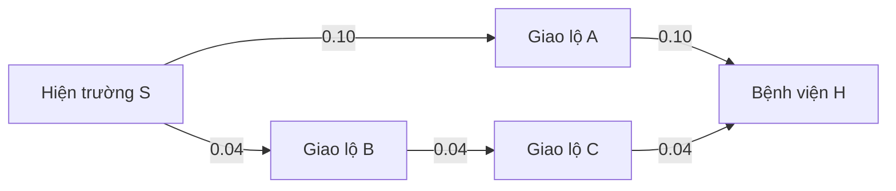

# Demo Video Script — chưa quay

> Đây là kịch bản sản xuất, **không phải bằng chứng video đã tồn tại**. Thay mọi `[[...]]`, rehearsal trên final commit, rồi mới ghi hình. Thời lượng gợi ý 14–17 phút để giải thích đủ 8 thuật toán, heuristic, multi-stop và demo thực tế.

## 1. Production card

| Item | Value to fill |
|---|---|
| Group / course | `[[GROUP_ID — COURSE]]` |
| Final commit | `[[COMMIT]]` |
| Dataset version | `1.0.0` — verified via `/api/v1/health` |
| Presenter A | `[[NAME — context/data]]` |
| Presenter B | `[[NAME — algorithms/heuristics]]` |
| Presenter C | `[[NAME — app demo/multi-stop]]` |
| Presenter D/E optional | `[[NAME — experiment/conclusion]]` |
| Target duration | `[[14–17 minutes]]` |
| Recording resolution | 1920×1080 minimum |
| Published link | `[[NOT YET CREATED]]` |

### Required on-screen footer

Keep this readable whenever the map is visible:

> © OpenStreetMap contributors — ODbL 1.0 · Traffic/ETA/risk are deterministic educational simulations, not live dispatch advice.

## 2. Original illustrative graph

The lab asks for a group-designed illustration rather than a copied tutorial. Use this five-node “mini emergency corridor” derived from the repository's own algorithm test idea and redraw it in the group's visual style.



Assume outgoing order from `S` is `A` then `B`.

| Route | Hops | Composite cost |
|---|---:|---:|
| `S→A→H` | 2 | 0.20 |
| `S→B→C→H` | 3 | 0.12 |

Use the following safe heuristic to illustrate A*/Greedy:

| Node | `h(n)` |
|---|---:|
| S | 0.08 |
| A | 0.03 |
| B | 0.07 |
| C | 0.03 |
| H | 0.00 |

It is admissible (`h` never exceeds true remaining optimum) and consistent for every shown edge. It is deliberately shaped so Greedy sees A as closest-looking, while A* still sees the cheaper B corridor after adding `g`.

Do not say these decimal costs are kilometres or minutes. They are a small, group-designed **composite score** for explaining frontier behavior.

## 3. Timeline and exact narration

### 00:00–00:35 — Cold open

**Shot:** finished UI full screen; route visible; quick cuts Route → Compare → Multi. Do not linger on loading/setup.

**Presenter A:**

> “Một tuyến ngắn hơn chưa chắc đưa xe cấp cứu tới bệnh viện sớm hơn. Project của nhóm mô hình hóa mạng đường trung tâm Đà Nẵng thành graph có hướng, rồi so sánh tám thuật toán tìm kiếm trên cùng một cost gồm khoảng cách, ETA mô phỏng, traffic delay và risk exposure. Đây là ứng dụng học thuật localhost; traffic và risk không phải dữ liệu thời gian thực.”

**Overlay:** title, group ID, safety disclaimer, OSM attribution.

### 00:35–01:20 — Problem and dataset

**Shot:** map overview, then a clean provenance split graphic.

**Presenter A:**

> “Topology, tên đường, hướng đi và hospital POI bắt nguồn từ snapshot OpenStreetMap qua một bounded Overpass query. Pipeline giữ primary, secondary và tertiary roads, co shape points giữa các giao lộ, giữ polyline và OSM IDs, rồi snap hospital POI vào junction gần nhất. Snapshot hiện có 512 node và 1.007 directed edge sau khi loader mở rộng các đoạn hai chiều.”

> “Phần congestion, ETA theo scenario, flood susceptibility, incident, closure và risk là lớp synthetic deterministic do nhóm tạo. Cùng input luôn cho cùng overlay, nhưng tuyệt đối không được gọi là live traffic.”

**On-screen facts:** 5,903 raw road nodes → 488 contracted road nodes + 24 hospital POIs → 512 nodes; 756 base edge records → 1,007 directed edges.

### 01:20–02:10 — Graph and cost model

**Shot:** one directed edge highlighted; animate source/target, attributes, then formula.

**Presenter A:**

> “State là node hiện tại; action là đi qua một outgoing edge còn traversable; goal test là node hiện tại bằng bệnh viện được chọn. Edge đóng trong scenario hoặc không cho emergency access bị loại.”

> “Backend chuẩn hóa bốn trọng số rồi tính: distance theo kilomet, travel time theo phút, traffic delay theo phút, và risk nhân kilomet exposure. Tổng route cost là tổng edge cost. Vì mọi thành phần không âm, UCS và Dijkstra có điều kiện tối ưu cần thiết.”

**On screen:**

```text
C(e)=ŵd·distance_km + ŵt·travel_minutes
    + ŵc·delay_minutes + ŵr·(risk×distance_km)
```

**Callout:** congestion label 1–5 is visualization; numeric time/delay drives cost.

### 02:10–04:40 — Eight pair-search algorithms on the original mini graph

Keep the same graph on screen. Animate frontier, expanded nodes, `g/h/f`. Use a small table that updates; do not replace explanation with a wall of theory.

#### BFS — 20 seconds

**Presenter B:**

> “BFS dùng FIFO và mở rộng theo tầng. Với adjacency A trước B, thứ tự expand là S, A, B, rồi H; parent đầu tiên của H tạo route S–A–H. BFS bảo đảm ít hop nhất trên finite graph, nhưng cost 0.20 cao hơn route ba hop cost 0.12.”

Show queue after `S`: `[A,B]`; after `A`: `[B,H]`.

#### DFS — 15 seconds

> “DFS dùng LIFO, đi sâu nhánh A trước và tới H. Nó complete trong implementation finite-graph có discovered set, nhưng không tối ưu và rất nhạy thứ tự neighbor.”

Show stack and emphasize no weighted comparison.

#### UCS and Dijkstra — 30 seconds

> “UCS chọn frontier có g nhỏ nhất. Nó đi S, B, C; dù A có thể được mở rộng trước goal tùy label, H cuối cùng nhận g bằng 0.12 và route S–B–C–H. Dijkstra trong backend dùng chính implementation này, nên hai nhãn có cùng chính sách và bảo đảm optimum với edge cost không âm.”

Show relax values: `g(A)=.10`, `g(B)=.04`, `g(C)=.08`, `g(H)=.12`.

#### A* — 30 seconds

> “A* chọn f bằng g cộng h. Sau S: A có f 0.13, B có f 0.11. Nó chọn B, rồi C có f 0.11, H có f 0.12, nên tìm route cost 0.12. Với heuristic admissible và consistent, A* giữ bảo đảm optimum.”

Show `g/h/f` labels and highlight why A* does not follow the visually close A.

#### Greedy Best-First — 20 seconds

> “Greedy chỉ nhìn h. Vì h(A)=0.03 nhỏ hơn h(B)=0.07, nó chọn A rồi H, trả cost 0.20. Nó thường ít expansion nhưng không có bảo đảm weighted optimum.”

#### Bidirectional Dijkstra — 25 seconds

> “Bidirectional Dijkstra chạy label từ S qua outgoing edge và từ H qua incoming edge. Khi hai wave có meeting cost tốt nhất và tổng hai minimum frontier không thể cải thiện nó, thuật toán dừng. Trên graph có hướng, backward wave bắt buộc dùng incoming edges.”

Show two colors, meeting near B/C.

#### IDA* — 25 seconds

> “IDA* chạy depth-first với ngưỡng f. Ngưỡng bắt đầu 0.08, rồi tăng tới minimum f bị prune, lần lượt 0.11 và 0.12, cuối cùng tìm route cost 0.12. Nó dùng ít frontier memory nhưng re-expand nhiều; trong app, route dài có thể chạm max-expansions và trả limit_reached.”

#### Summary — 15 seconds

**On-screen table:** minimum hops vs minimum weighted cost vs heuristic vs memory.

> “Complete và optimal là claim có điều kiện, không phải nhãn marketing. Expansion budget, edge costs và heuristic được ghi rõ trong metadata và explanation.”

### 04:40–05:35 — Heuristic design

**Shot:** Learn mode heuristic registry, then formula graphic.

**Presenter B:**

> “App có four heuristics. Zero luôn bằng 0. Haversine dùng great-circle distance đã scale theo minimum ratio giữa edge length và geometry để không overestimate. Travel-time lấy distance lower bound chia max graph speed, nên cũng optimistic. Ba heuristic này admissible và consistent.”

> “Traffic-aware lấy mean traffic multiplier ở outgoing edges rồi chiếu tới goal. Nó có thể nhanh thực dụng nhưng có thể overestimate và inconsistent. Chọn nó với A* hoặc IDA* sẽ mất optimality guarantee, và UI/API phải hiện warning.”

**Do:** point to admissible/consistent badges.

### 05:35–06:15 — Architecture

**Shot:** one clean architecture diagram; optional short code zoom, no scrolling through files.

**Presenter A:**

> “React gọi versioned FastAPI contract. Pydantic validate request; RoutingEngine ghép immutable RoadGraph, deterministic TrafficModel, CostCalculator, heuristic registry và search. Mọi thuật toán trả cùng trace schema. Multi-stop dùng directed Dijkstra matrix trước khi optimize order. Snapshot được build offline; app runtime không gọi Overpass.”

Show: React → `/api/v1` → Engine → graph/cost/search/multi; OSM snapshot on disk; optional OSM tile requests from browser.

### 06:15–08:20 — Live Route mode

**Shot:** actual final app, browser zoom 100%, no devtools unless showing response intentionally.

Use this reproducible case:

```text
Start: osm_420248644 — Nút Đường Nguyễn Chí Thanh
Goal: hospital_way_372433638 — Bệnh viện Đà Nẵng
Algorithm: astar
Heuristic: travel_time
Scenario: morning_rush
Weights: distance .25, travel_time .50, traffic_delay .20, risk .05
```

**Presenter C actions and words:**

1. Select start/goal by dropdown, then demonstrate that map clicks snap to nearest graph node.
2. Select A*/travel-time/morning rush and show sliders.
3. Click Run.

> “Response của run mẫu có 8 edge, khoảng 1.549 mét, ETA mô phỏng khoảng 173.5 giây và weighted cost khoảng 2.02076. Runtime sẽ khác theo máy nên chúng em không coi một con số milliseconds là định luật.”

4. Point to cost breakdown and optimality.

> “A* được gọi là optimal ở đây vì travel-time heuristic admissible/consistent và run không chạm expansion limit. Cost là optimum theo snapshot, scenario và weight hiện tại—not a real dispatch guarantee.”

5. Point to alternative.

> “Tuyến đối chứng được tạo bằng cách lần lượt loại một edge của primary, chạy Dijkstra, rồi giữ candidate rẻ nhất. Trong case này nó cao hơn khoảng 2.01%. Đây là best single-primary-edge-exclusion candidate, không phải full k-shortest enumeration.”

6. Play trace at 1×, pause midway, step forward/back; name current/frontier/visited and `g/h/f`.

### 08:20–09:15 — Traffic scenario sensitivity

**Shot:** keep same distant case for visible differences:

```text
Start: osm_10177662786 — Nút Đường Hoàng Sa
Goal: hospital_way_372433638 — Bệnh viện Đà Nẵng
Algorithm: dijkstra
Default weights
```

Run `normal`, then `morning_rush`, then `evening_rush` or use prepared screen recording from final app.

**Presenter C:**

> “Normal cho ETA khoảng 665 giây. Morning rush tăng lên khoảng 891 giây và chọn một edge sequence khác. Evening rush khoảng 1.010 giây và lại đổi route. Những con số này tái lập từ deterministic scenario model, không phải đo ngoài đường.”

Optional incident shot:

> “Incident đóng 37 directed edges đã được gắn cờ deterministic. Closed edge bị loại; số đóng toàn graph không có nghĩa route nào cũng thay đổi.”

### 09:15–10:35 — Compare mode

**Shot:** same start/goal/scenario/weights, select BFS, DFS, UCS, Dijkstra, A*, Greedy, Bidirectional and IDA* if UI/time permits.

**Presenter D or C:**

> “Compare giữ nguyên graph, traffic, endpoints và weights. Ranking ưu tiên found, rồi cost thấp, fewer expanded nodes và algorithm ID; runtime được hiển thị nhưng không dùng làm tie-break.”

Point out:

- BFS fewer hops but higher cost;
- DFS detour;
- UCS/Dijkstra same optimum policy;
- A* fewer expansions than Dijkstra in the documented test;
- Greedy matching optimum in this one case does not create a guarantee;
- IDA* high re-expansion and small active frontier.

> “Muốn kết luận runtime, cần nhiều repeats và median/IQR. Video chỉ trình bày một controlled demonstration.”

### 10:35–12:20 — Multi-stop exact vs approximate

**Shot:** Multi mode. Use a start in the largest strongly connected core so return-to-start is feasible.

```text
Start: osm_345351408 — Võ Nguyên Giáp × Hồ Xuân Hương
Stops:
  hospital_way_372433638 — Bệnh viện Đà Nẵng
  hospital_way_372433951 — Bệnh viện C Đà Nẵng
  hospital_node_729405662 — Bệnh viện Hoàn Mỹ Đà Nẵng
  hospital_way_489789425 — Vinmec Đà Nẵng
Return to start: true
Scenario: morning_rush
```

**Presenter C:**

> “Backend trước hết chạy Dijkstra cho mọi ordered pair trong start plus stops. Với bốn stop là 20 search vì hướng A tới B có thể khác B tới A.”

Run/show Nearest Neighbor:

> “Nearest Neighbor có cost mẫu khoảng 30.71648. Nó approximate vì chọn stop rẻ nhất hiện tại.”

Run/show 2-opt:

> “2-opt bắt đầu từ greedy và đảo subsequence khi cost giảm. Case này còn 28.52343, giảm khoảng 7.14%.”

Run/show Held–Karp:

> “Held–Karp cũng ra 28.52343 và bảo đảm exact trên directed pairwise matrix, nhưng exponential và API giới hạn 10 stop.”

Mention SA:

> “Simulated Annealing dùng seed cố định và cleanup 2-opt. Nó approximate dù trong case này cũng chạm cost exact. Matching one case không phải proof tổng quát.”

Point to requested order vs optimized order, combined route, pairwise effort and explanation.

### 12:20–13:10 — Validation and failure behavior

**Shot:** Swagger or UI error state, then one short test-output shot from final run.

**Presenter B:**

> “API từ chối unknown node, duplicate stops, duplicate algorithms, weight total bằng zero và Held–Karp quá 10 stops bằng structured 422. Search phân biệt unreachable và limit_reached. Trace truncation không dừng search; nó chỉ giới hạn dữ liệu animation.”

Show final actual commands/results:

```text
Backend verification: **28 pytest cases passed; 89% statement coverage** on Python 3.13.14 / Windows.

Frontend verification: **4 Vitest tests passed; Vite production build passed; 2 Microsoft Edge Playwright e2e tests passed** (route/trace/compare plus theory/mobile flows).
```

Do not say “all tests pass” unless the captured final-commit output proves it.

### 13:10–14:05 — Limitations and ethics

**Shot:** limitations list over subdued map.

**Presenter A:**

> “Dataset chỉ giữ ba road classes trong một bounded area; turn restriction và alley có thể thiếu. Hospital connector là snap gần nhất, không xác nhận cổng hay năng lực tiếp nhận. Một số gateway nằm ngoài strongly connected core. Weights chưa được calibration bằng ambulance telemetry. Public OSM tiles là best-effort và chỉ dùng interactive theo policy.”

> “Vì vậy project chứng minh cách mô hình hóa và so sánh AI search, không cung cấp chỉ dẫn cấp cứu.”

### 14:05–14:35 — Closing

**Shot:** route + compare + team credits.

**Presenter A:**

> “Kết quả chính là một hệ thống end-to-end có dữ liệu và provenance rõ, tám search algorithms, bốn heuristics, bốn multi-stop methods, trace thống nhất và explanation có điều kiện tối ưu. Source, report, dataset description và video link được đóng gói theo đúng format của lab.”

Only keep the final sentence if packaging is actually complete at recording time; otherwise say “sẽ được đóng gói”.

## 4. Shot list

| # | Shot | Must be visible | Captured? |
|---:|---|---|---:|
| 1 | Cold open route | map, route, OSM attribution, disclaimer | [ ] |
| 2 | Data provenance graphic | OSM vs derived vs synthetic | [ ] |
| 3 | Mini graph BFS/DFS | queue/stack and expansion order | [ ] |
| 4 | Mini graph UCS/Dijkstra | `g` relaxations | [ ] |
| 5 | Mini graph A*/Greedy | `g/h/f` and different decisions | [ ] |
| 6 | Mini graph bidirectional/IDA* | two waves and f thresholds | [ ] |
| 7 | Heuristic registry | admissible/consistent/warning | [ ] |
| 8 | Architecture | React/FastAPI/engine/data flow | [ ] |
| 9 | Route configuration | start/goal/algorithm/weights/scenario | [ ] |
| 10 | Trace playback | current/frontier/visited/reason | [ ] |
| 11 | Metrics/explanation | distance/ETA/cost/expanded/runtime | [ ] |
| 12 | Alternative | dashed route/card/difference | [ ] |
| 13 | Scenario comparison | route/ETA difference | [ ] |
| 14 | Compare | chart and table | [ ] |
| 15 | Multi-stop NN | requested/optimized order | [ ] |
| 16 | Multi-stop Held–Karp | exact badge/metrics | [ ] |
| 17 | Error/validation | structured error, no crash | [ ] |
| 18 | Final tests | actual final-commit terminal output | [ ] |
| 19 | Limitations/credits | OSM/ODbL and safety | [ ] |

## 5. Recording runbook

### Before recording

- [ ] Freeze final commit and dataset checksum.
- [ ] Run backend tests and frontend lint/build.
- [ ] Start backend on 127.0.0.1:8000 and frontend on localhost:5173.
- [ ] Warm each demo request once; do not edit output values to make them look better.
- [ ] Reset browser zoom, clear unrelated tabs/notifications/bookmarks.
- [ ] Verify Vietnamese fonts/diacritics and map attribution at 1080p.
- [ ] Prepare offline fallback: `VITE_ENABLE_OSM_TILES=false` plus graph geometry, and pre-rendered diagrams. Do not cache/scrape public OSM tiles for offline video.
- [ ] Ensure no API key, username, personal path or notification is visible.
- [ ] Rehearse exact node selections; use IDs in speaker notes.

### During recording

- [ ] Speak “simulated/deterministic” whenever first describing traffic/risk.
- [ ] Pause long enough for viewers to read `g/h/f`, frontier and captions.
- [ ] Keep pointer away from attribution/footer.
- [ ] If a runtime differs from report, explain natural variability rather than re-recording only to chase a number.
- [ ] If a route fails, read `status`: do not confuse `limit_reached` and `unreachable`.

### After recording

- [ ] Add chapter titles/captions; captions match spoken caveats.
- [ ] Check audio, frame rate, text readability and no cropped attribution.
- [ ] Confirm every implemented pair algorithm is named and explained.
- [ ] Confirm multi-stop exact/approximate distinction is spoken.
- [ ] Export, watch end-to-end, then upload.
- [ ] Test shared link in incognito/private window.
- [ ] Put URL only in `[[GroupID - Video]].txt` as required.
- [ ] Replace `[[NOT YET CREATED]]` in project records only after validation.

## 6. Presenter Q&A crib sheet

**Why not OSMnx at runtime?**  
The application needs a deterministic, offline teaching graph and reproducible traces. A one-time Overpass snapshot plus a transparent standard-library contraction pipeline avoids runtime network/data drift. OSMnx would be a valid alternative ETL tool, not a requirement.

**Why is A* sometimes slower in milliseconds with fewer expansions?**  
Heuristic calls and Python overhead cost time; small single runs are noisy. Expansion efficiency and wall-clock time are related but not identical.

**Why count travel time and delay separately?**  
Travel time represents total ETA; delay is an extra controllable congestion aversion term. The report states the deliberate double sensitivity and lets weights control it.

**Is Haversine always a lower bound when imported edge length is imperfect?**  
The graph computes the minimum edge-distance/Haversine ratio, clamps it at 1, and scales all straight-line estimates by that factor.

**Is Held–Karp optimal?**  
Yes for the computed directed pairwise weighted-cost matrix and supported stop count, assuming pair searches complete. It is not a guarantee about live real-world dispatch.

**Why can multi-stop be unreachable?**  
The graph is directed. A geographic cluster can lack a required directed return path; the largest strongly connected component should be used for a return-to-start demo.

**Does the alternative route equal the second-shortest path?**  
Not generally. It is the cheapest Dijkstra result among runs that each exclude one edge of the primary route.

**Where does traffic come from?**  
Project-defined deterministic scenario formulas; not from OSM and not a live API.
