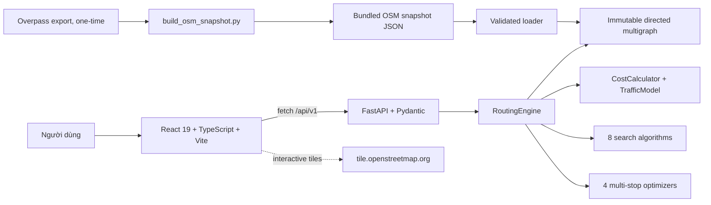
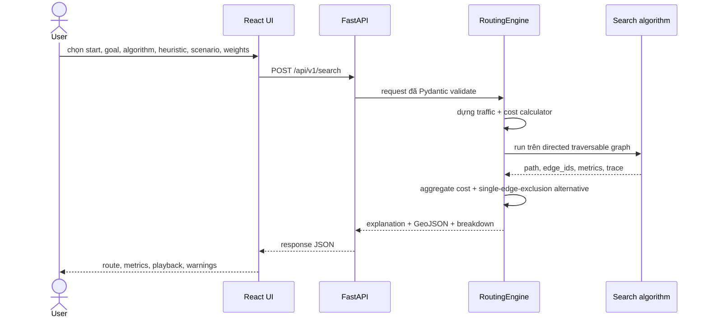
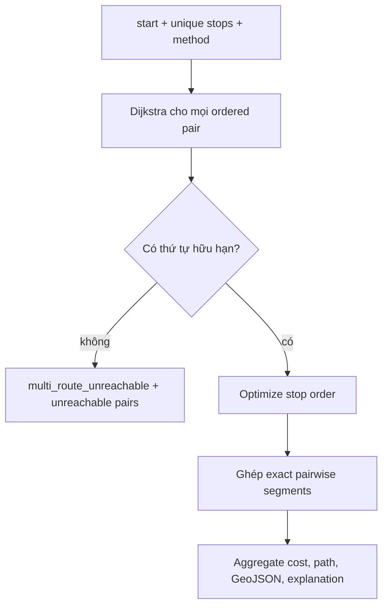
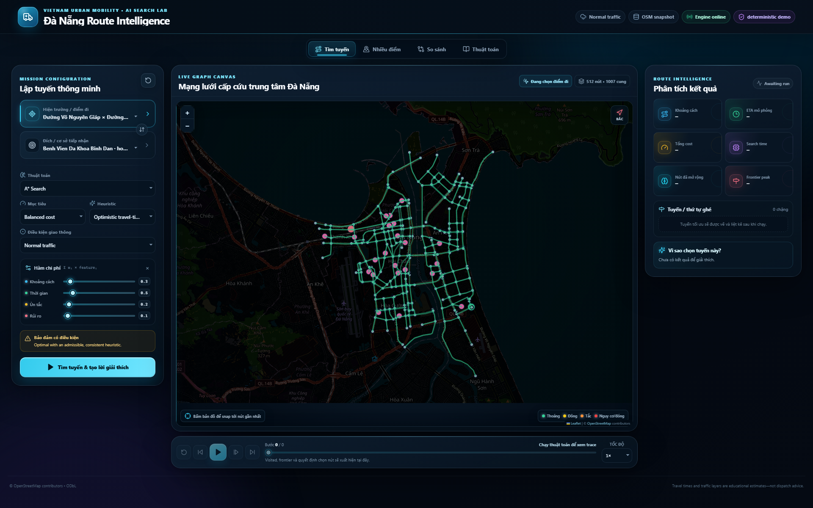
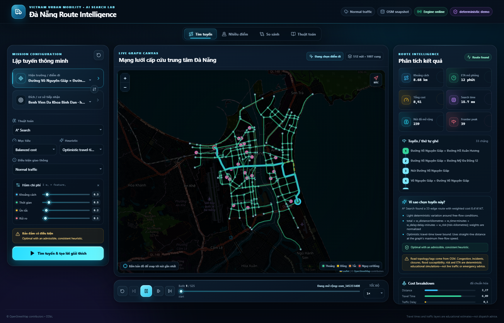
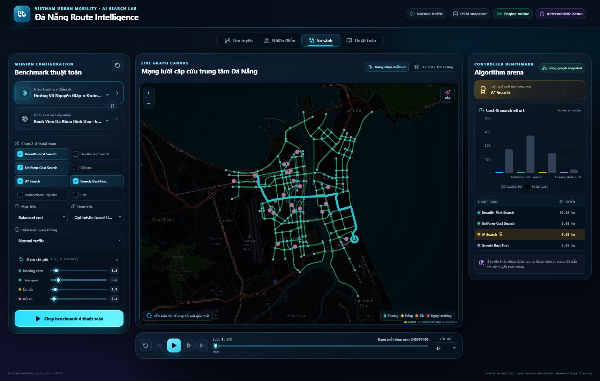

# Báo cáo kỹ thuật — Đà Nẵng Emergency Route Intelligence

> **Trạng thái tài liệu:** bản báo cáo nguồn (Markdown) để nhóm điền thông tin, chèn ảnh thật và xuất PDF. Các vị trí có dạng `[[...]]` là nội dung con người phải hoàn thiện trước khi nộp. Không được hiểu các placeholder ảnh/video là artifact đã tồn tại.

## A. Thông tin nhóm

| Trường | Nội dung cần điền |
|---|---|
| Mã nhóm | `[[GROUP_ID]]` |
| Tên nhóm | `[[GROUP_NAME]]` |
| Lớp / học phần | `[[CLASS_AND_COURSE]]` |
| Giảng viên | `[[INSTRUCTOR]]` |
| Đại diện nộp bài | `[[REPRESENTATIVE_NAME — STUDENT_ID]]` |
| Ngày chốt phiên bản | `[[YYYY-MM-DD]]` |
| Commit/tag dùng để nộp | `[[GIT_COMMIT_OR_RELEASE]]` |

| Thành viên | MSSV | Vai trò và phần đóng góp cụ thể | Mức hoàn thành tự đánh giá |
|---|---|---|---:|
| `[[MEMBER_1]]` | `[[ID_1]]` | `[[CONTRIBUTION_1]]` | `[[%]]` |
| `[[MEMBER_2]]` | `[[ID_2]]` | `[[CONTRIBUTION_2]]` | `[[%]]` |
| `[[MEMBER_3]]` | `[[ID_3]]` | `[[CONTRIBUTION_3]]` | `[[%]]` |
| `[[MEMBER_4_OPTIONAL]]` | `[[ID_4]]` | `[[CONTRIBUTION_4]]` | `[[%]]` |
| `[[MEMBER_5_OPTIONAL]]` | `[[ID_5]]` | `[[CONTRIBUTION_5]]` | `[[%]]` |

## 1. Tóm tắt dự án

Dự án xây dựng một phòng thí nghiệm tìm kiếm đường đi cho **xe cấp cứu tại khu vực trung tâm Đà Nẵng**. Người dùng chọn hiện trường, cơ sở y tế, thuật toán, heuristic, kịch bản giao thông và trọng số mục tiêu; hệ thống trả về tuyến có hướng trên graph đường bộ, quá trình mở rộng node, các chỉ số thực nghiệm, phân rã chi phí và một tuyến đối chứng khi tồn tại.

Điểm phân biệt quan trọng của dữ liệu:

- **Topology và tag đường/POI** được lấy từ một snapshot OpenStreetMap (OSM) giới hạn theo bounding box, sau đó co rút các shape point thành graph dạy học.
- **Ùn tắc, ETA theo kịch bản, nguy cơ ngập, sự cố, đóng đường và risk** là lớp mô phỏng giáo dục deterministic do chương trình tạo. Chúng **không** phải quan sát trực tiếp từ OSM, không phải live traffic và không đủ điều kiện dùng cho điều phối cấp cứu thật.

Phiên bản hiện tại có 512 node và 1.007 cung có hướng sau khi nạp; vượt yêu cầu tối thiểu 20 node/30 edge. Backend FastAPI cung cấp contract `/api/v1`; frontend React/Vite hiển thị graph trên Leaflet, hỗ trợ Route, Multi-stop, Compare, Learn và phát lại trace.

## 2. Bối cảnh và bài toán thực tế

### 2.1 Kịch bản Việt Nam

Trong điều phối xe cấp cứu, đường ngắn nhất theo mét chưa chắc có ETA thấp nhất. Cầu, trục chính, đường một chiều, mưa lớn hoặc một sự cố giả lập có thể làm tăng thời gian và thay đổi tuyến khả thi. Hệ thống vì vậy tối ưu một cost tổng hợp thay vì chỉ tối ưu khoảng cách.

Ứng dụng giải hai lớp bài toán:

1. **Hai địa điểm:** tìm tuyến từ hiện trường `s` đến bệnh viện `g`.
2. **Nhiều địa điểm:** từ `s`, chọn thứ tự ghé tập điểm `P={p1,…,pn}`, có thể quay lại `s`, rồi ghép các shortest path có hướng giữa từng cặp liên tiếp.

### 2.2 Phạm vi và an toàn

Đây là phần mềm học thuật chạy localhost. Không có GPS, năng lực bệnh viện, trạng thái xe, thời gian thực, quy định ưu tiên xe cứu thương hay feed sự cố chính thức. Kết quả chỉ dùng để minh họa AI search.

> **Cảnh báo bắt buộc khi demo/báo cáo:** “Road topology/tags come from OSM. Traffic, ETA, flood susceptibility, incidents, closures and risk are deterministic educational simulations—not live dispatch advice.”

## 3. Mô hình hóa bài toán

### 3.1 Graph trạng thái

Mạng đường được biểu diễn bằng directed multigraph bất biến `G=(V,E)`:

- `V`: giao lộ, gateway, điểm tiếp cận cầu hoặc POI bệnh viện.
- `E`: cung đường có hướng. Hai cung song song giữa cùng một cặp node được phép.
- State ban đầu: node `start_id`.
- Goal test: node hiện tại bằng `goal_id`.
- Transition: đi qua một cung outgoing còn traversable.
- Cung bị đóng trong kịch bản hoặc `emergency_access=false` bị loại khỏi tập transition.

Mỗi node có `id`, `name`, `kind`, `lat`, `lon`, `attributes`. Mỗi edge có `source`, `target`, `distance_m`, `speed_kph`, `road_name`, `road_class`, `risk`, `emergency_access`, polyline và thuộc tính provenance.

### 3.2 Hàm chi phí

Với edge `e`, đặt:

- `d_e = distance_m / 1000` (km);
- `t0_e = d_e / speed_kph × 60` (phút free-flow);
- `M_e(q) ≥ 1` là multiplier deterministic của scenario `q`;
- `t_e = M_e(q) × t0_e` (phút ETA mô phỏng);
- `Δt_e = t_e - t0_e` (phút delay);
- `x_e = risk_e × d_e` (risk exposure).

Trọng số đầu vào không âm được chuẩn hóa:

```text
ŵ_i = w_i / (w_distance + w_time + w_delay + w_risk)
```

Cost của edge và tuyến là:

```text
C(e) = ŵ_distance·d_e
     + ŵ_time·t_e
     + ŵ_delay·Δt_e
     + ŵ_risk·x_e

C(route) = Σ C(e)
```

`C` là score không thứ nguyên sau khi cộng các feature đã quy về km/phút/exposure. Tất cả thành phần không âm; edge đóng nhận cost vô hạn và không được traverse. Điều này đáp ứng điều kiện trọng số không âm của UCS/Dijkstra/A*/Bidirectional Dijkstra.

Lưu ý để tránh giải thích sai:

- Nhãn congestion `light/moderate/heavy/severe` dùng cho hiển thị. Cost dùng **travel time và delay số**, không cộng trực tiếp một số 1–5.
- `travel_time` đã chứa free-flow và delay; `traffic_delay` được cộng thêm có chủ ý để người dùng tăng/giảm mức phạt ùn tắc độc lập.
- Slider có thể nhập trọng số thô 0–5; backend luôn chuẩn hóa nên tỷ lệ giữa các trọng số mới quyết định kết quả.

### 3.3 Kịch bản giao thông deterministic

Cho `b = SHA256(scenario + "|" + edge_id)` được ánh xạ ổn định về `[0,1]`:

```text
M_e(q) = max(1, base_q × road_factor_e,q × (1 + jitter_q × b))
```

| Scenario | `base` | `jitter` | Điều chỉnh bổ sung |
|---|---:|---:|---|
| `normal` | 1.00 | 0.08 | dao động nhẹ quanh free-flow |
| `morning_rush` | 1.22 | 0.28 | ×1.12 cho `primary`/`arterial` |
| `evening_rush` | 1.30 | 0.32 | ×1.18 trên cầu; nếu không, ×1.09 cho trục lớn |
| `heavy_rain` | 1.34 | 0.22 | ×`(1+0.16·risk)`; cầu thêm ×1.16 |
| `incident` | 1.12 | 0.18 | ×1.20 cho `incident_prone`; đóng edge có cờ `close_during_incident` |

Cùng dataset + request luôn sinh cùng multiplier và route (không tính `runtime_ms` và UUID). `incident` hiện đóng 37 cung có hướng được gắn cờ trước; không chọn ngẫu nhiên tại request time.

## 4. Dataset

Dataset chính là `backend/data/da_nang_osm_snapshot.json`, snapshot OSM base timestamp `2026-08-05T01:34:50Z`, bounding box `[16.035,108.190,16.090,108.250]`. Pipeline giữ các way `primary|secondary|tertiary`, co chuỗi shape point bậc 2, bảo toàn chiều đi, giữ geometry/OSM IDs và snap POI bệnh viện vào junction gần nhất bằng connector mô phỏng.

| Chỉ số | Giá trị |
|---|---:|
| Raw road nodes trong largest undirected component | 5.903 |
| Raw road ways | 843 |
| Junction/gateway sau contraction | 488 |
| Hospital POI giữ lại | 24 |
| Node lưu trong snapshot | 512 |
| Base edge record lưu trong JSON | 756 |
| Base record đánh dấu hai chiều | 251 |
| Directed edge sau loader expansion | 1.007 |
| Max graph speed | 60 km/h |
| Distance lower-bound calibration scale | 0,998783081 |

Nguồn gốc từng field, toàn bộ danh sách bệnh viện, schema, pipeline tái tạo và nghĩa pháp lý được trình bày tại [DATASET.md](DATASET.md).

## 5. Thuật toán tìm đường

Hệ thống triển khai 8 thuật toán hai điểm—gấp đôi mức tối thiểu BFS, DFS, UCS, A* và nhiều hơn yêu cầu “ít nhất hai thuật toán bổ sung”. Tất cả dùng một `SearchResult` và một trace schema chung.

| ID | Frontier/ưu tiên | Complete trong graph hữu hạn* | Bảo đảm tối ưu |
|---|---|---|---|
| `bfs` | FIFO, độ sâu nhỏ nhất | Có | Chỉ minimum-hop, không minimum weighted cost |
| `dfs` | LIFO, đi sâu trước | Có | Không |
| `ucs` | min `g(n)` | Có với cost không âm | Có |
| `dijkstra` | min distance label `g(n)` | Có với cost không âm | Có |
| `astar` | min `f=g+h` | Có | Có khi `h` admissible/consistent |
| `greedy_best_first` | min `h(n)` | Có trên graph hữu hạn | Không |
| `bidirectional_dijkstra` | hai min-heap từ start/goal | Có với cost không âm | Có |
| `ida_star` | DFS lặp theo ngưỡng `f` | Có về lý thuyết với cost dương hữu hạn | Có với heuristic admissible |

\* Mọi run còn chịu `max_expansions`; nếu chạm budget thì status là `limit_reached`, nên bảo đảm lý thuyết không đồng nghĩa mọi request thực tế đều hoàn tất.

Chi tiết nguyên lý, complexity, tie-breaking, heuristic proof và trace event: [ALGORITHM_REFERENCE.md](ALGORITHM_REFERENCE.md).

## 6. Thiết kế heuristic

Registry có bốn lựa chọn:

1. `zero`: `h(n)=0`; admissible và consistent; A* trở thành UCS/Dijkstra.
2. `haversine`: cost distance của great-circle lower bound đã hiệu chỉnh theo dataset.
3. `travel_time`: thêm optimistic time = straight-line distance / max graph speed.
4. `traffic_aware`: nhân time bằng mean multiplier ở outgoing edges của node hiện tại; hữu ích thực dụng nhưng có thể overestimate và không consistent.

Để bảo vệ claim admissibility khi distance import hơi ngắn hơn hình học, graph tính:

```text
s = min(1, min_e distance_e / haversine(source_e,target_e))
```

rồi dùng `s × haversine(n,goal)`. Vì `s×haversine` tuân bất đẳng thức tam giác, mọi edge có `distance_e` ít nhất bằng lower bound đã scale, mọi thành phần cost bị bỏ qua đều không âm, và `travel_time` chia cho tốc độ tối đa toàn graph, `haversine`/`travel_time` đều admissible và consistent đối với cost đang tối ưu. Proof đầy đủ nằm trong tài liệu thuật toán.

## 7. Tối ưu nhiều địa điểm

Với `n` stop, backend chạy Dijkstra chính xác cho mọi cặp có hướng khác nhau trong `{start}∪stops`, tổng cộng `n(n+1)` pairwise search. Ma trận cost này được đưa vào một trong bốn optimizer:

| Method | Exact? | Complexity chính | Giới hạn/ý nghĩa |
|---|---:|---|---|
| Nearest Neighbor | Không | `O(n²)` | nhanh, phụ thuộc lựa chọn cục bộ |
| Nearest Neighbor + 2-opt | Không | bounded local search | đảo subsequence khi giảm cost |
| Held–Karp | Có | `O(n²·2ⁿ)` time, `O(n·2ⁿ)` memory | exact trên ma trận có hướng; tối đa 10 stop |
| Seeded Simulated Annealing + 2-opt | Không | theo `max_iterations` | reproducible với cùng seed/input |

API nhận tối đa 12 stop; Held–Karp bị chặn ở 10. “Exact” ở đây nghĩa là thứ tự tối thiểu trên **pairwise weighted-cost matrix của snapshot/scenario hiện tại**, không phải bảo đảm tối ưu đối với thế giới giao thông thật. Các segment trong mọi method đều là exact Dijkstra path nếu search không chạm expansion limit.

## 8. Kiến trúc hệ thống



### 8.1 Thành phần backend

- `loader.py`: đọc JSON UTF-8, kiểm tra ID/coordinate/distance, mở rộng base edge hai chiều và chuẩn hóa orientation của polyline.
- `domain.py`: node/edge immutable, adjacency outgoing/incoming, GeoJSON, Haversine calibration.
- `traffic.py`: scenario overlay deterministic, closure và congestion label.
- `costs.py`: chuẩn hóa trọng số, edge cost, aggregate breakdown.
- `heuristics.py`: registry và metadata admissibility/consistency.
- `algorithms.py`: 8 thuật toán và trace contract.
- `multi_stop.py`: 4 optimizer thứ tự ghé.
- `engine.py`: orchestration, explanation, alternative, compare và response payload.
- `main.py` + `schemas.py`: FastAPI route, validation, CORS, OpenAPI và error envelope.

### 8.2 Thành phần frontend

- React Query quản lý health/metadata/graph/search mutation.
- `api.ts` chuyển contract backend sang view model UI.
- React Leaflet hiển thị OSM tiles tùy chọn, road geometry, congestion, node, route và alternative.
- Playback dựng lại `visited/frontier/newly_discovered` từ stream trace chuẩn hóa.
- Recharts hiển thị cost/search effort trong Compare.
- Framer Motion và CSS responsive tạo chuyển cảnh, trạng thái loading/error và panel layout.

### 8.3 Luồng search hai điểm



### 8.4 Luồng multi-stop



## 9. Giải thích tuyến và tuyến đối chứng

Mỗi response thành công nêu:

- số edge và total weighted cost;
- điều kiện optimality của thuật toán/heuristic;
- mô tả traffic scenario;
- công thức cost;
- warning về heuristic không admissible, thuật toán không tối ưu, trace bị cắt và disclaimer dataset.

Tuyến đối chứng **không phải full k-shortest paths**. Backend lần lượt cấm từng edge thuộc tuyến chính, chạy Dijkstra với `h=0`, giữ candidate khác tuyến có cost nhỏ nhất, rồi báo edge bị loại và phần trăm chênh cost so với primary. Nếu không còn candidate hợp lệ thì `alternative=null`.

Ví dụ đã chạy trực tiếp trên snapshot, A* `travel_time`, `morning_rush`, trọng số backend mặc định, từ `osm_420248644` (Nút Đường Nguyễn Chí Thanh) tới `hospital_way_372433638` (Bệnh viện Đà Nẵng):

- primary: 8 edge, 1.548,73 m, ETA mô phỏng 173,50 s, cost 2,02075749;
- alternative tốt nhất sau single-edge exclusion: 7 edge, cost 2,061297752, cao hơn 2,006191%;
- ví dụ này chứng minh tuyến ít hop hơn vẫn có thể có weighted cost cao hơn.

Runtime không được dùng như một hằng số vì phụ thuộc máy và lần chạy.

## 10. Đánh giá thực nghiệm

### 10.1 Protocol

Để so sánh công bằng:

- cùng snapshot `1.0.0` và cùng directed topology;
- cùng start/goal, scenario `morning_rush`;
- cùng trọng số thô `(0.25,0.50,0.20,0.05)`; tổng đã bằng 1;
- heuristic `travel_time` cho thuật toán dùng heuristic;
- không ghi trace trong lần benchmark backend này;
- `max_expansions=100000`;
- runtime đo phần search, không gồm HTTP, render hay animation.

Test case: `osm_420248644` → `hospital_way_372433638`.

Measurement record: one-shot local diagnostic on Windows/CPython 3.14, workspace state dated 2026-08-05; hardware and background load were not recorded. Route/cost/expansion values are deterministic evidence for that code/data, while the runtime column is preliminary. Before submission, rerun on the frozen commit, record CPU/RAM/Python, use warm-up plus multiple repetitions, and replace one-shot runtime with median/IQR if runtime is used for a graded conclusion.

| Thuật toán | Found | Cost | Distance (m) | ETA (s) | Expanded | Generated | Frontier peak | Hops | Runtime một lần (ms) |
|---|---:|---:|---:|---:|---:|---:|---:|---:|---:|
| BFS | ✓ | 2,070682000 | 1.492,40 | 181,78 | 43 | 63 | 23 | 6 | 1,2513 |
| DFS | ✓ | 19,071229798 | 14.197,95 | 1.642,17 | 219 | 262 | 77 | 57 | 4,8255 |
| UCS | ✓ | 2,020757490 | 1.548,73 | 173,50 | 45 | 66 | 20 | 8 | 0,4977 |
| Dijkstra | ✓ | 2,020757490 | 1.548,73 | 173,50 | 45 | 66 | 20 | 8 | 1,0868 |
| A* | ✓ | 2,020757490 | 1.548,73 | 173,50 | 26 | 42 | 18 | 8 | 2,4572 |
| Greedy Best-First | ✓ | 2,020757490 | 1.548,73 | 173,50 | 9 | 20 | 12 | 8 | 1,1122 |
| Bidirectional Dijkstra | ✓ | 2,020757490 | 1.548,73 | 173,50 | 21 | 42 | 21 | 8 | 0,3356 |
| IDA* | ✓ | 2,020757490 | 1.548,73 | 173,50 | 848 | 1.827 | 10 | 8 | 99,5132 |

Diễn giải đúng mức:

- BFS chọn 6 hop nhưng cost cao hơn optimum; đúng với mục tiêu minimum-hop của BFS.
- DFS rất nhạy thứ tự adjacency và tạo tuyến dài.
- UCS/Dijkstra/A*/Bidirectional/IDA* đồng ý cost optimum trong test này.
- A* mở rộng 26 node so với 45 của Dijkstra, nhưng Python heuristic calculation khiến runtime một lần không nhất thiết nhỏ hơn.
- Greedy tình cờ trùng optimum ở test này; điều đó **không tạo bảo đảm tối ưu tổng quát**.
- IDA* tiết kiệm frontier nhưng re-expand nhiều; trên tuyến xa hơn có thể chạm expansion budget.

### 10.2 Ảnh hưởng scenario

Test thứ hai dùng Dijkstra, trọng số mặc định, từ `osm_10177662786` (Nút Đường Hoàng Sa) tới Bệnh viện Đà Nẵng:

| Scenario | Cost | Distance (m) | ETA (s) | Delay (s) | Hops | Route signature* |
|---|---:|---:|---:|---:|---:|---|
| normal | 7,480669827 | 7.190,04 | 665,27 | 28,60 | 29 | `1eff2ef5` |
| morning_rush | 10,086356892 | 7.178,62 | 890,58 | 247,55 | 28 | `ffd17479` |
| evening_rush | 11,482595192 | 7.168,60 | 1.009,51 | 369,65 | 26 | `e64f716c` |
| heavy_rain | 11,331302137 | 7.190,04 | 995,32 | 358,65 | 29 | `1eff2ef5` |
| incident | 8,762906272 | 7.190,04 | 775,17 | 138,51 | 29 | `1eff2ef5` |

\* 8 ký tự đầu SHA-256 của ordered `edge_ids`, chỉ dùng để nhận biết tuyến khác nhau mà không in một danh sách edge rất dài. Morning/evening tạo route khác normal; rain tăng ETA/cost nhưng không bắt buộc đổi topology đã chọn; incident loại 37 edge toàn graph nhưng route optimum của case này vẫn trùng signature normal.

### 10.3 Multi-stop exact và approximate

Test 4 stop, quay về điểm đầu, `morning_rush`, start `osm_345351408` (Võ Nguyên Giáp × Hồ Xuân Hương), các stop: Bệnh viện Đà Nẵng, Bệnh viện C, Hoàn Mỹ và Vinmec.

| Method | Cost | Distance (m) | ETA (s) | Optimizer iterations | Improvements | Claim |
|---|---:|---:|---:|---:|---:|---|
| Nearest Neighbor | 30,716479398 | 21.926,45 | 2.691,82 | 4 | 0 | approximate |
| 2-opt | 28,523431994 | 20.161,92 | 2.503,72 | 11 | 2 | approximate; bằng optimum trong case này |
| Held–Karp | 28,523431994 | 20.161,92 | 2.503,72 | 48 | 0 | exact trên matrix |
| Seeded SA + 2-opt | 28,523431994 | 20.161,92 | 2.503,72 | 2.000 | 4 | approximate; bằng optimum trong case này |

2-opt giảm 7,1396% cost so với Nearest Neighbor trong test này. Không được suy rộng rằng 2-opt/SA luôn đạt Held–Karp.

## 11. Giao diện và cách sử dụng

### 11.1 Cài đặt localhost

Yêu cầu: Python 3.11–3.13 được khuyến nghị, Node.js phù hợp Vite 6, npm.

Terminal 1:

```powershell
cd backend
python -m venv .venv
.venv\Scripts\Activate.ps1
python -m pip install -r requirements.txt
python -m uvicorn app.main:app --reload --host 127.0.0.1 --port 8000
```

Terminal 2:

```powershell
cd frontend
npm install
npm run dev
```

Mở `http://localhost:5173`; Swagger tại `http://127.0.0.1:8000/docs`. Vite proxy `/api` sang backend nên không cần cấu hình thêm cho dev mặc định.

### 11.2 Quy trình demo UI

1. **Route:** chọn start/goal bằng dropdown hoặc click map; chọn algorithm, heuristic, objective, scenario; điều chỉnh sliders; chạy.
2. Xem polyline chính/đối chứng, metric cards, breakdown và explanation.
3. Dùng playback để lùi/tiến/play, đổi tốc độ; quan sát current/frontier/visited.
4. **Compare:** chọn 2–8 thuật toán và chạy cùng một request nền.
5. **Multi-stop:** chọn start, thêm các stop, method và tùy chọn quay về; chạy optimizer.
6. **Learn:** xem metadata về completeness, optimality và heuristic.

### 11.3 Ảnh chạy thật đã chụp

**Hình 1 — Dashboard sau khi nạp snapshot OSM.** FastAPI báo online; UI hiển thị 512 node, 1.007 directed edge và attribution OSM.



**Hình 2 — A* route và trace playback.** Input mặc định do local graph index chọn, heuristic optimistic travel-time, scenario Normal; ảnh cho thấy final polyline, metrics, explanation, optimality, cost breakdown và timeline trace.



**Hình 3 — Controlled benchmark.** BFS, UCS, A* và Greedy Best-First chạy trên cùng graph/scenario/weights; chart, winner và bảng route metrics được render từ response thật.



Trước khi export PDF cuối, nhóm nên chụp bổ sung Multi-stop, Incident/Heavy Rain và Learn/heuristic registry, rồi ghi input IDs/names, scenario và mã commit trong caption. Ba hình trên được tạo bằng Microsoft Edge headless trên app localhost, không phải mockup.

## 12. Kiểm thử và tái lập

Backend tests bao phủ:

- path hợp lệ cho cả 8 thuật toán;
- cost optimum của UCS/Dijkstra/A*/Bidirectional/IDA* trên teaching graph;
- BFS minimum-hop khác weighted optimum;
- expansion limit và `start==goal`;
- deterministic traffic và incident closure;
- breakdown sum/weight normalization;
- loader mở rộng edge hai chiều và orient geometry;
- HTTP contracts, validation và multi-route;
- Held–Karp không tệ hơn greedy trên fixture; seeded annealing reproducible.

Kết quả verification hiện tại trên Windows, Python 3.13.14:

```powershell
cd backend
py -3.13 -m pytest -q --cov=app --cov-report=term-missing
```

Kết quả: **28 passed**, tổng statement coverage **89%**. Ngoài pytest, live API smoke đã xác nhận 512 node/1.007 directed edge/1.007 GeoJSON feature; A* trả route + trace + alternative và invariant `total_cost == Σ components`; Compare trả 4 run; Held–Karp trả đủ 3 segment.

Frontend static, contract và browser checks:

```powershell
cd frontend
npm test
npm run build
npm run test:e2e
```

Kết quả: **4/4 Vitest contract tests**, production build thành công với các chunk riêng cho React/map/chart/motion, và **2/2 Playwright–Microsoft Edge e2e tests**. E2E thật sự click A*, kiểm tra route/trace/cost breakdown, chạy benchmark 4 thuật toán, mở theory deck và kiểm tra layout mobile 430 px; browser console không có uncaught error trong các flow này.

Trước khi nộp, chạy lại `scripts/check.ps1` và `npm run test:e2e` trên mã commit cuối, vì số liệu trên phản ánh workspace ngày 2026-08-05 trước khi nhóm điền thông tin cá nhân/slides.

## 13. Hạn chế

1. Snapshot chỉ phủ bounding box trung tâm và chỉ giữ `primary|secondary|tertiary`; alley/residential road có thể thiếu.
2. Contraction dựa trên graph vô hướng để chọn junction nhưng bảo toàn direction trên edge; một số gateway một chiều không thuộc strongly connected core. Multi-stop quay về điểm đầu có thể infeasible dù các điểm gần nhau về địa lý.
3. POI bệnh viện lấy từ OSM tag/name tại timestamp snapshot; không xác nhận khoa cấp cứu, năng lực tiếp nhận hay giờ hoạt động.
4. Connector từ POI tới junction gần nhất là đường thẳng mô phỏng, không bảo đảm đúng cổng vào thực tế.
5. Speed tag/default, risk, flood, incident và traffic đều không phải live measurement.
6. Cost weight là quyết định mô hình; chưa được hiệu chỉnh bằng dữ liệu xe cấp cứu hoặc khảo sát chuyên gia.
7. Alternative chỉ xét việc loại từng edge của primary, không liệt kê toàn bộ k-shortest routes.
8. Runtime đơn lẻ bị ảnh hưởng bởi máy, cache và Python; đánh giá nghiêm túc cần warm-up, nhiều lần lặp, median/IQR.
9. IDA* có thể re-expand rất lớn và chạm `max_expansions` trên route xa.
10. UI dùng public OSM raster tiles khi bật; phụ thuộc mạng, best-effort và policy nhà cung cấp. Có thể tắt bằng `VITE_ENABLE_OSM_TILES=false` nhưng graph/route nội bộ vẫn chạy.
11. Đây không phải hệ thống safety-critical; không có authentication, persistence, audit log hay HA.

## 14. Hướng phát triển

- nhập feed traffic được cấp phép và ghi provenance/timestamp cho từng edge;
- map-matching cổng bệnh viện thay connector thẳng;
- cập nhật OSM theo versioned ETL và regression checks;
- k-shortest/Yen/Eppstein và lý do đối chứng giàu ngữ nghĩa hơn;
- Contraction Hierarchies/ALT cho graph lớn;
- time-dependent shortest path và constraint xe/đường;
- multi-vehicle routing, capacity, time windows và năng lực bệnh viện;
- benchmark harness nhiều lần lặp và xuất CSV;
- self-hosted hoặc commercial tiles phù hợp khi deploy quy mô lớn;
- accessibility, i18n hoàn chỉnh và end-to-end browser tests.

## 15. Attribution và tài liệu liên quan

Map data: **© OpenStreetMap contributors**, available under the **Open Data Commons Open Database License (ODbL) 1.0**.

- [OpenStreetMap Copyright and License](https://www.openstreetmap.org/copyright)
- [ODbL 1.0 full license](https://opendatacommons.org/licenses/odbl/1-0/)
- [OSMF Tile Usage Policy](https://operations.osmfoundation.org/policies/tiles/)
- [Overpass API documentation](https://wiki.openstreetmap.org/wiki/Overpass_API)
- [API contract](API.md)
- [Dataset specification](DATASET.md)
- [Algorithm reference](ALGORITHM_REFERENCE.md)
- [Rubric checklist](RUBRIC_CHECKLIST.md)
- [Demo video script](DEMO_VIDEO_SCRIPT.md)

OSM/OSMF không bảo trợ hoặc xác nhận dự án này. Lớp traffic/risk mô phỏng là sản phẩm của dự án, không phải dữ liệu do OSM contributors cung cấp.
